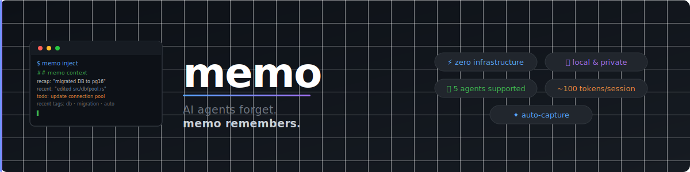

<p align="center">
  
</p>

<h1 align="center">memo — Persistent memory for AI coding agents</h1>

<p align="center">
  Give Claude Code, Cursor, Windsurf, and GitHub Copilot a memory that survives across sessions.<br/>
  One command to set up. Zero manual steps. Works in any project.
</p>

<p align="center">
  <a href="https://github.com/rustkit-ai/memo/actions/workflows/ci.yml"></a>
  <a href="https://crates.io/crates/memo-agent"></a>
  <a href="LICENSE"></a>
</p>

---

**Every AI session starts from scratch.** The agent re-reads files it already read, re-discovers conventions it already learned, asks questions it already asked. On a large codebase this wastes hundreds of tokens and minutes of context-building — every single time.

`memo` fixes this with a compact context block (~80 tokens) injected at session start. The agent writes it. The agent reads it. You just work.

```
$ memo inject

## memo context
last: 2026-03-15 — "refactored auth middleware, JWT now stateless"
todo: fix token refresh in utils.rs:42
recent tags: refactor · auth · bug
```

---

## Install

**cargo**:
```sh
cargo install memo-agent
```

**curl** (Linux / macOS):
```sh
curl -fsSL https://github.com/rustkit-ai/memo/releases/latest/download/install.sh | sh
```

**brew**:
```sh
brew tap rustkit-ai/memo https://github.com/rustkit-ai/memo
brew install memo
```

---

## Claude Code — fully automatic

Claude Code is a CLI tool with a native hook system. `memo` uses the **Stop hook** to update context automatically when you close a session — no manual steps, ever.

```sh
memo setup
```

Three things happen:

1. `CLAUDE.md` gets memo instructions and an initial context block
2. `.claude/settings.json` gets a Stop hook that runs `memo inject --claude` every time you close Claude Code
3. Claude reads `CLAUDE.md` automatically at startup — it already knows what was done last session

### The Claude Code loop

```
Open Claude Code
      │
      ▼
Claude reads CLAUDE.md  ←── context from last session
      │
      ▼
You work — Claude logs:
  memo log "implemented OAuth2 via Google provider"
  memo log "todo: handle token expiry edge case"
      │
      ▼
You close Claude Code
      │
      ▼
Stop hook fires automatically → memo inject --claude
      │
      ▼
CLAUDE.md updated silently — ready for next session
```

### Example

```
You: what did we do last time?

Claude: Based on memo — you implemented OAuth2 via Google provider.
        Pending: handle token expiry edge case.
        Want me to pick up from there?
```

No copy-pasting. No manual notes. Claude picks up exactly where it left off.

---

## Cursor, Windsurf, GitHub Copilot — agent-triggered

Cursor, Windsurf, and Copilot are IDE extensions — they don't expose a session lifecycle hook like Claude Code does. Instead, `memo setup` writes instructions directly into their rules files, telling the agent to run the inject command itself at the start of each session.

```sh
memo setup
```

| Agent | Rules file | Inject command |
|---|---|---|
| **Cursor** | `.cursor/rules/memo.mdc` (`alwaysApply: true`) | `memo inject --cursor` |
| **Windsurf** | `.windsurfrules` | `memo inject --windsurf` |
| **GitHub Copilot** | `.github/copilot-instructions.md` | `memo inject --copilot` |

### The Cursor / Windsurf / Copilot loop

```
Open agent
      │
      ▼
Agent reads rules file (loaded automatically)
      │
      ▼
Agent runs: memo inject --[agent]
      │
      ▼
Rules file updated with latest context
      │
      ▼
Agent knows where it left off — starts working
      │
      ▼
You work — agent logs:
  memo log "migrated DB to PostgreSQL 16"
  memo log "todo: update connection pool config"
      │
      ▼
Next session — same loop
```

### Example

```
You: [opens Cursor]

Cursor: Based on memo — last session you migrated the DB to PostgreSQL 16.
        Pending: update the connection pool config. Should I start there?
```

The difference from Claude Code: the context file is updated **at the start** of the next session rather than at the end of the current one. The result is the same — the agent always knows where it left off.

---

## Agent guides

Full setup and usage details for each agent:

- [Claude Code — fully automatic via Stop hook](docs/agents/claude-code.md)
- [Cursor — persistent context with alwaysApply rules](docs/agents/cursor.md)
- [Windsurf — session memory via .windsurfrules](docs/agents/windsurf.md)
- [GitHub Copilot — persistent instructions across sessions](docs/agents/copilot.md)

---

## Commands

| Command | Description |
|---|---|
| `memo setup` | One-time setup for all agents |
| `memo init` | Initialize project memory |
| `memo log "<message>"` | Save a memory entry |
| `memo log "<message>" --tag refactor` | Save with a tag |
| `memo log -` | Read message from stdin |
| `memo inject` | Print context block to stdout |
| `memo inject --claude` | Write context into `CLAUDE.md` |
| `memo inject --cursor` | Write context into `.cursor/rules/memo.mdc` |
| `memo inject --windsurf` | Write context into `.windsurfrules` |
| `memo inject --copilot` | Write context into `.github/copilot-instructions.md` |
| `memo inject --since 7d` | Limit context to last 7 days |
| `memo inject --format json` | JSON output for programmatic use |
| `memo list` | Show last 10 entries |
| `memo list --all` | Show all entries |
| `memo list --tag bug` | Filter by tag |
| `memo search <query>` | Full-text search across all entries |
| `memo delete <id>` | Delete a specific entry |
| `memo tags` | List all tags with usage counts |
| `memo stats` | Entry count and token savings estimate |
| `memo clear` | Clear all memory for current project |

---

## Why not just edit the rules files manually?

You can — but then **you** do the work. `memo` lets the agent maintain its own memory, automatically, without any human intervention between sessions. The agent writes. The agent reads. You just focus on your code.

---

## License

MIT — [rustkit-ai/memo](https://github.com/rustkit-ai/memo)
